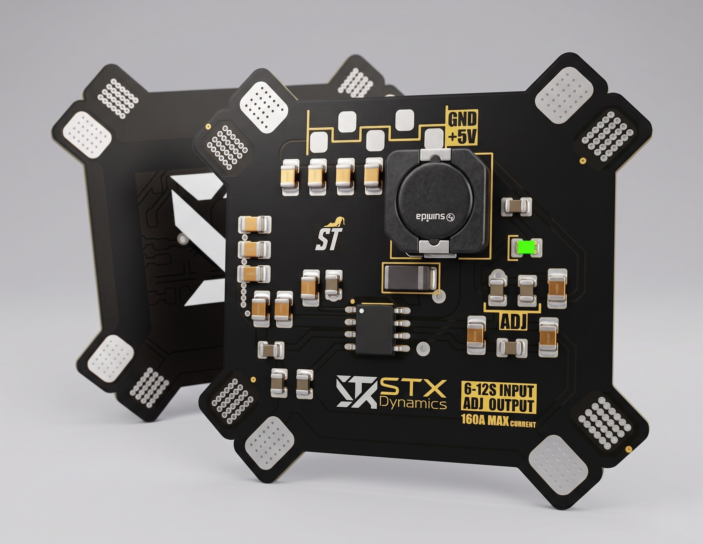

<div align="center">

# STX Dynamics — 160A High-Current Power Distribution Board

**Model:** STX-PDB-160-R1 · **Part No:** `SXPDB160A`

A heavy-duty power distribution board (PDB) for 6S–12S high-power multirotor and RC platforms,
featuring an adjustable regulated output and up to 160 A continuous current distribution.

<!-- Replace the badge values below once you've set up the repo / releases / license -->


</div>



---

## Overview

The **STX-PDB-160** distributes battery power to multiple speed controllers (ESCs) from a single
high-current input, while providing an **adjustable regulated output (ADJ)** for powering flight
controllers, receivers, and other peripherals at the voltage your build requires.

It is built around an ST regulator/controller with a Sumida shielded power inductor and
high-current copper distribution across a cross-shaped board with eight corner solder-pad arrays.
The board targets **6S–12S** systems and a continuous current of up to **160 A** — double the
capacity of the STX-PDB-80.


---

## Key Features

- **Wide input range** — supports 6S to 12S battery packs
- **Very high current capacity** — up to 160 A continuous distribution
- **Adjustable regulated output (ADJ)** — set the output voltage to match your peripherals
- **`+5V` / `GND` output header** for low-voltage electronics
- **Eight high-current solder-pad arrays** for distributing power to multiple ESCs
- **Shielded power inductor** (Sumida) for efficient, low-noise regulation
- **Cross/X-shaped form factor** suited to arm-mounted ESC layouts

---

## Specifications

| Parameter | Value |
|---|---|
| Battery input | 6S – 12S LiPo |
| Input voltage (nominal) | ≈ 22.2 V – 44.4 V |
| Input voltage (max, fully charged) | ≈ 50.4 V |
| Max continuous current | 160 A |
| Regulated output | Adjustable (ADJ) |
| Output current rating | **5A** |
| Auxiliary output | `+5V` / `GND` header |
| Regulator / controller | STMicroelectronics |
| Power inductor | Sumida (shielded) |
| Dimensions (L × W) | **60x55** mm |
| Mounting pattern | **M3** (corner solder pads) |
| Weight | **18** g |
| Operating temperature | **90** |

> Voltage figures are derived from cell count (3.7 V nominal / 4.2 V max per cell). Confirm against
> your validated test data before publishing.

---

## Board Layout & Connections

| Marking | Function |
|---|---|
| `6-12S INPUT` | Battery input |
| `ADJ OUTPUT` | Adjustable regulated output |
| `ADJ` | Output voltage adjustment |
| `+5V` / `GND` | Auxiliary 5 V output / ground |
| `160A MAX CURRENT` | Rated max continuous current |
| Corner pad arrays | High-current ESC / power solder pads |

**Top side** carries the active components — the ST regulator/controller, the Sumida power
inductor, current-sense/power resistors, an indicator LED, and the output headers. **Bottom side**
carries the STX Dynamics "X" branding; the part number `SXPDB160A` should be etched here for
consistency with the rest of the line.

<!-- TODO: add an annotated board photo or pinout diagram here, e.g. -->
<!-- <div align="center"></div> -->

---

## Bill of Materials (key components)

| Ref | Component | Manufacturer | Part No. |
|---|---|---|---|
| U1 | Regulator / controller IC | STMicroelectronics | **-** |
| L1 | Shielded power inductor | Sumida | **-** |
| R-shunt | Current-sense / power resistors | **-** | **-** |
| D1 | Indicator LED | **-** | **-** |
| C-bulk | Filter capacitors | **-** | **-** |

> Manufacturers identified from package markings/logos on the board. Add exact part numbers and
> all passives from your design files. A full BOM (`BOM.csv`) is recommended in the repo root or
> `/hardware`.

---

## Getting Started

> ⚠️ **Always disconnect the battery before soldering or modifying connections.**

1. **Mount** the board to your frame using the corner solder-pad arms, ensuring no exposed pads
   contact the frame or other conductive surfaces.
2. **Solder the battery input** leads to the designated input pads, observing correct polarity.
3. **Solder each ESC** power lead to the corner distribution pads, keeping leads short and balanced.
4. **Set the ADJ output** to your required voltage and verify it with a multimeter **before**
   connecting any sensitive electronics.
5. **Connect peripherals** (flight controller, receiver) to the regulated / `+5V` output.
6. **Verify** all joints for shorts and cold solder before applying power.

### Operating Notes

- Keep total continuous draw within the **160 A** rating; size your wiring and connectors accordingly.
- Double-check the ADJ output voltage after any adjustment — applying an incorrect voltage can
  damage connected electronics.
- Ensure adequate airflow around the regulator and inductor under sustained high load.

---

## Product Numbering

STX Dynamics products use a dual identifier: a **human-readable** code and a **compact** code
etched on the hardware. Both encode the same fields.

| Field | Readable | Compact |
|---|---|---|
| Company | `STX` | `SX` |
| Family | `PDB` | `PDB` |
| Max current (A) | `160` | `160` |
| Revision | `R1` | `A` |

**This product:** `STX-PDB-160-R1` ⇄ `SXPDB160A`

Compact format: `SX` + family token + 3-digit current + revision letter (`A` = R1, `B` = R2, …).

**Family lineup so far:** `SXPDB080A` (80 A, fixed 5V/4A BEC) · `SXPDB160A` (160 A, adjustable output)

---

## Repository Structure

```
.
├── README.md            # This file
├── LICENSE              # TODO: choose a license
├── CHANGELOG.md         # Revision history
├── hardware/            # Schematics, board files, gerbers
│   ├── schematic.pdf
│   └── BOM.csv
└── docs/
    └── images/          # Board photos, pinout, diagrams
```

<!-- Adjust to match how you actually organize the repo. Remove this section if it's a documentation-only repo. -->

---

## Documentation

- 📄 Datasheet — **-**
- 🔌 Wiring guide — **-**
- 🛠️ Assembly guide — **-**

---

## Revision History

| Revision | Part No. | Date | Notes |
|---|---|---|---|
| R1 | `SXPDB160A` | **2025** | Initial release |

---

## Contributing

Issues and pull requests are welcome. For hardware change requests, please open an issue
describing the proposed change and the use case.

<!-- If this is not an open-hardware project, replace this section with support/RMA contact instructions instead. -->

---

## Support & Contact

- **Company:** STX Dynamics
- **Email:** **stuncdemir0@gmail.com**
- **Website:** **stxdynamics.com**

---

<div align="center">

© STX Dynamics. All rights reserved.

</div>
